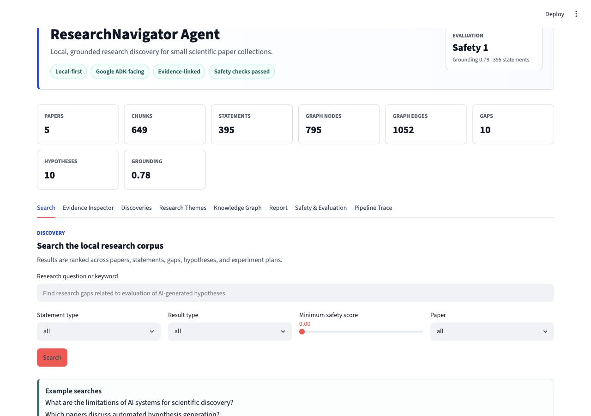
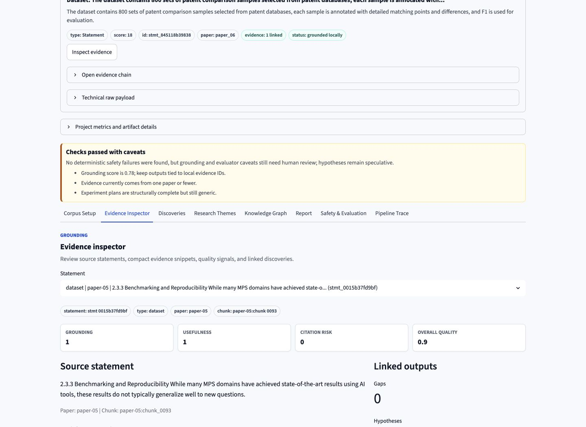
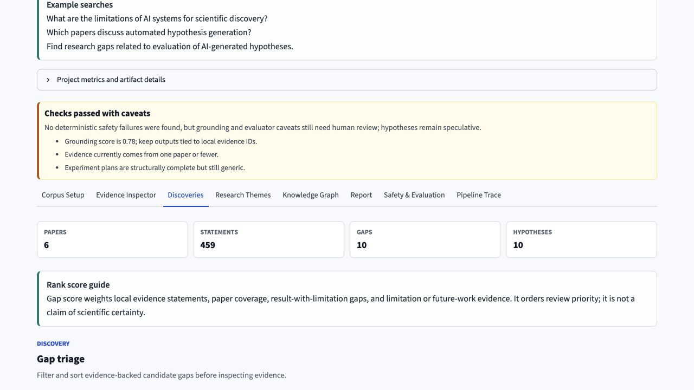
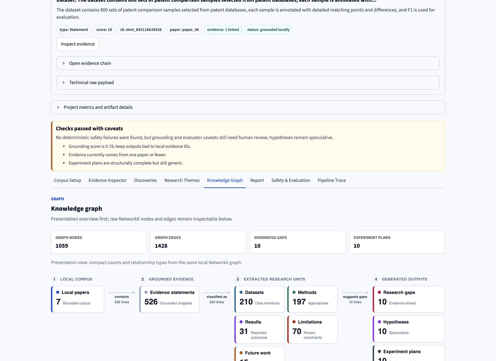
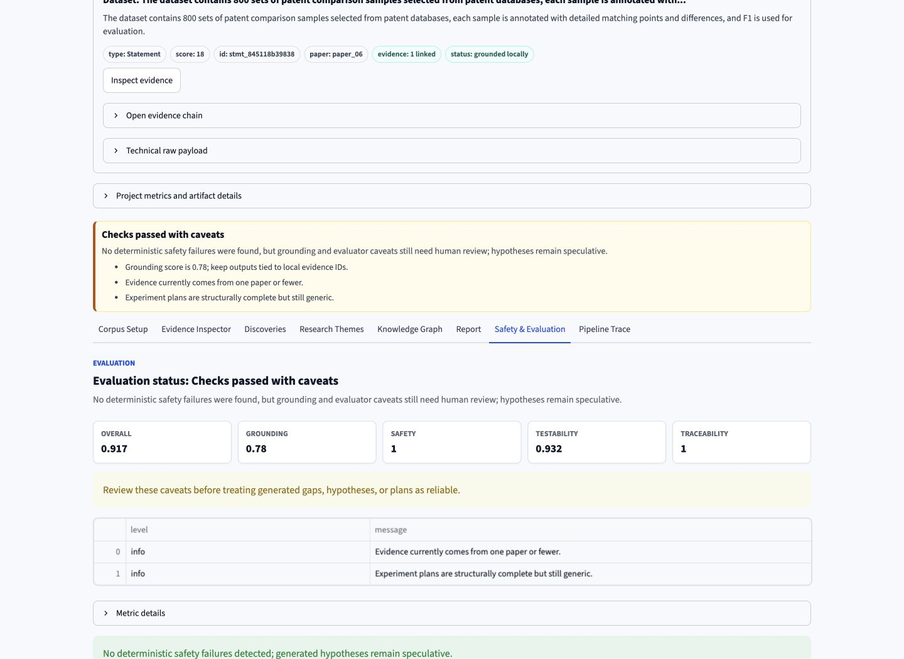
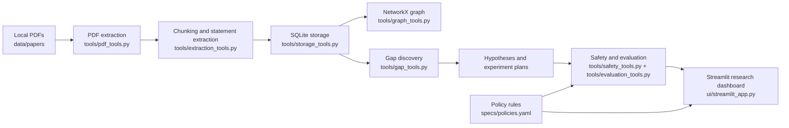

# ResearchNavigator Agent

**Status:** `local-first` `no cloud deployment` `no LLM calls in deterministic MVP` `preflight-ready` `5/5 golden evals` `submission ready`

**Core stack:** `Google ADK-ready` `Streamlit` `SQLite` `NetworkX` `pytest`

ResearchNavigator Agent is a local-first Google ADK-facing research-discovery assistant for the **Agents for Good** track. The MVP ingests 5-10 local scientific papers, extracts structured research knowledge, builds a local knowledge graph, identifies research gaps, proposes testable hypotheses, and generates experiment plans.

The current prototype includes deterministic ingestion, extraction, graph construction, gap discovery, hypothesis generation, experiment planning, safety checks, evaluation metrics, policy checks, and a local Streamlit dashboard.

## Competition Demo

Run the full local backend pipeline with one command:

```bash
uv run python -m scripts.run_demo --reset
```

Then launch the dashboard:

```bash
uv run streamlit run ui/streamlit_app.py
```

Open `Corpus Setup` in the dashboard to add or replace permitted local PDFs under `data/papers/`.
The app keeps uploads local, updates `data/papers/manifest.json`, and shows the backend commands to regenerate processed artifacts.

Run deterministic golden cases:

```bash
uv run python -m scripts.run_golden_evals
```

Shortcut commands are also available:

```bash
make demo
make audit
make coverage
make preflight
make eval
make validate
make samples
make lint
make typecheck
make ci
make test
make ui
make brief
make mcp
```

Demo narration:

- `docs/demo_script.md`

Judge-facing docs:

- `SUBMISSION.md`
- `docs/kaggle_submission_package.md`
- `docs/kaggle_video_script.md`
- `docs/capstone_evaluation_mapping.md`
- `docs/agent_technology_story.md`
- `docs/mcp_server.md`
- `docs/antigravity_demo_notes.md`
- `docs/system_card.md`
- `docs/reproducibility.md`
- `docs/judge_walkthrough.md`
- `docs/security_review.md`
- `docs/dependency_audit.md`
- `docs/coverage_report.md`
- `CHANGELOG.md`
- `configs/default.yaml`

Sample output gallery:

- `docs/sample_outputs/researchnavigator_brief_excerpt.md`
- `docs/sample_outputs/evaluation_report_excerpt.json`
- `docs/sample_outputs/golden_eval_report_excerpt.json`
- `docs/sample_outputs/top_discoveries_excerpt.json`

## Demo Screenshots

Search-first discovery:



Evidence inspector:



Ranked discoveries:



Knowledge graph preview:



Safety and evaluation:



## Architecture



## Why This Is Competition-Ready

- Local-first: papers and outputs stay on the machine.
- Grounded: gaps and hypotheses reference local statement IDs.
- Evaluated: reports include grounding, safety, testability, traceability, warnings, and failed checks.
- Policy-gated: proposed tool actions can be checked against role, environment, and sensitive-context rules.
- Demo-ready: one command runs the full backend pipeline.
- Preflighted: `scripts/preflight.py` checks local dependencies, config, project files, generated artifacts, schemas, and graph size before a demo.
- Dependency-audited: `scripts/dependency_audit.py` checks declared dependencies against `uv.lock`, direct usage, local-first risk, and dependency footprint without network calls.
- Coverage-visible: `scripts/coverage_report.py` generates local pytest coverage JSON and Markdown reports.
- ADK-facing: `app/agent.py` exposes a lightweight Google ADK entry point over deterministic local tools.
- MCP-ready: `app/mcp_server.py` exposes selected local tools through a local MCP server wrapper.
- Submission-checked: `scripts/validate_submission.py` verifies docs, artifacts, manifest, evals, and corpus size.
- CI-ready: `.github/workflows/ci.yml` runs lint, typecheck, tests, golden evals, and validation.
- Configurable: `configs/default.yaml` centralizes local paths, thresholds, and pipeline limits.
- Typed: `app/schemas/` defines Pydantic contracts for papers, statements, discoveries, and evaluation reports.
- Observable: key scripts emit structured local log events for demos and validation.
- Transparent: Streamlit exposes evidence, graph structure, gaps, hypotheses, plans, and evaluation details.

## Status

```text
Local-first: yes
Cloud deployment: no
LLM calls in deterministic MVP: no
Tests: 155 passed
Golden evals: 5/5 passed
Preflight: ready
Dependency audit: local/offline
Coverage report: local pytest-cov
Submission validator: ready
```

## Goals

- Help researchers explore small paper collections more systematically.
- Extract claims, methods, datasets, results, limitations, and future-work statements.
- Ground every output in local source passages and citations.
- Build a local NetworkX knowledge graph over papers, claims, methods, datasets, and gaps.
- Surface research gaps and hypotheses without overclaiming beyond the provided corpus.
- Evaluate extraction quality, grounding, graph correctness, safety behavior, and tool trajectory.

## Constraints

- Local-first prototype only.
- No cloud deployment.
- No model training or fine-tuning.
- MVP corpus limited to 5-10 local papers.
- Use only synthetic/sample papers or open-access papers.
- Use Google ADK for agent and tool orchestration.
- Use Streamlit only for the UI/dashboard.
- Use SQLite or DuckDB for structured storage.
- Use NetworkX for the knowledge graph.
- Use pytest for code tests.
- Add safety checks for prompt injection in papers, unsupported claims, fake citations, and overclaiming.

## Planned Folder Structure

```text
research-navigator-agent/
├── app/                         # ADK-facing agent package
│   ├── agents/                  # Agent definitions and orchestration
│   ├── tools/                   # ADK tools for ingestion, extraction, graph, retrieval, safety
│   ├── schemas/                 # Pydantic models for extracted paper structures
│   ├── storage/                 # SQLite or DuckDB access layer
│   ├── graph/                   # NetworkX graph construction and queries
│   └── safety/                  # Prompt-injection, citation, grounding, and overclaim checks
├── ui/                          # Streamlit dashboard
├── data/
│   ├── papers/                  # Local MVP papers; open-access or synthetic only
│   ├── samples/                 # Small sample fixtures
│   └── generated/               # Local generated artifacts such as extracted JSON and graph files
├── evals/                       # Golden cases and future ADK evaluation artifacts
├── specs/                       # Project, safety, and evaluation specifications
├── tests/                       # pytest tests for deterministic code behavior
├── AGENTS.md                    # Shared agent instructions
├── SKILL.md                     # Root project skill instructions
├── README.md
├── TODO.md
└── pyproject.toml
```

## MVP Workflow

1. Load a small local paper set from `data/papers/`.
2. Extract structured records for claims, methods, datasets, results, limitations, and future work.
3. Store extracted records in SQLite or DuckDB.
4. Build a NetworkX knowledge graph from papers, entities, and relationships.
5. Run safety and grounding checks on extracted and generated content.
6. Identify gaps, propose hypotheses, and draft experiment plans.
7. Review results in Streamlit.
8. Run pytest and evaluation cases before expanding the corpus.

## Current Status

Deterministic MVP implemented. The project includes a lightweight Google ADK-facing wrapper that exposes the existing local tools for agent orchestration.

## Production-Readiness Guardrails

The project includes spec-driven and policy-driven agent guidance:

- `AGENTS.md`: shared coding-agent instructions and review checklist.
- `SKILL.md`: root ResearchNavigator skill description.
- `.agent/skills/research-navigator/SKILL.md`: reusable agent skill in the workspace-style structure.
- `specs/behavior_scenarios.md`: Given/When/Then behavior scenarios for future ADK eval conversion.
- `specs/policies.yaml`: deterministic local policy rules for roles, environments, blocked tools, and sensitive context.
- `tools/policy_tools.py`: executable policy checks for proposed tool actions.
- `data/papers/manifest.json`: local paper manifest and license/source checklist.
- `app/agent.py`: ADK-facing root agent wrapper for the deterministic tool layer.
- `app/mcp_server.py`: local MCP server wrapper for selected deterministic tools.
- `app/schemas/`: Pydantic data contracts for core pipeline objects.

## Local Dashboard

The dashboard is a local, deterministic research discovery web app. It does not call an LLM.

Run the backend pipeline before launching Streamlit:

```bash
uv run python -m scripts.ingest_papers --papers-dir data/papers --db-path data/processed/papers.sqlite --extract-statements --filter-statements --max-statements-per-type-per-paper 30
uv run python -m scripts.build_graph --db-path data/processed/papers.sqlite --graph-path data/processed/research_graph.graphml
uv run python -m scripts.discover_gaps --db-path data/processed/papers.sqlite --output-path data/processed/gaps_and_hypotheses.json
uv run python -m scripts.evaluate_outputs --db-path data/processed/papers.sqlite --input-path data/processed/gaps_and_hypotheses.json --output-path data/processed/evaluation_report.json
uv run streamlit run ui/streamlit_app.py
```

Example searches:

- `What are the limitations of AI systems for scientific discovery?`
- `Which papers discuss automated hypothesis generation?`
- `Find research gaps related to evaluation of AI-generated hypotheses.`

Dashboard tabs:

- `Corpus Setup`: add or replace permitted local PDFs, review the manifest, and copy local processing commands.
- `Search`: search-first interface across papers, statements, gaps, hypotheses, and experiment plans.
- `Evidence Inspector`: grounded statement review with compact source evidence, linked gaps/hypotheses, and deterministic quality signals.
- `Discoveries`: ranked research gaps, generated hypotheses, and linked experiment-plan details.
- `Research Themes`: deterministic theme clusters from recurring statement keywords and graph coverage.
- `Knowledge Graph`: search-related graph sample or overview graph, with node and edge tables.
- `Report`: export a local Markdown research brief containing themes, ranked gaps, and candidate hypotheses.
- `Safety & Evaluation`: grounding, safety, testability, traceability, and failed checks.
- `Pipeline Trace`: paper-level ingestion status, technical pipeline steps, generated file status, commands, and raw backend tables.

## ADK Prototype Entry Point

The project includes a lightweight ADK-facing wrapper:

- `app/agent.py`: defines `root_agent` when `google.adk` is importable.
- `app/adk_tools.py`: exposes deterministic local tools for ingestion, graph building, discovery, evaluation, search, evidence inspection, policy checks, agent capability description, planned tool trajectory, and brief generation.

The agent technology story is intentionally local-first: ResearchNavigator uses a Google ADK-facing agent wrapper to orchestrate deterministic tools over local artifacts. The current MVP does not make LLM calls during tests or pipeline execution; instead it demonstrates the course concepts of tool orchestration, instruction boundaries, policy checks, grounded retrieval, evaluation, and traceability in a reproducible way.

In the Streamlit dashboard, open `Pipeline Trace` to see:

- the ADK agent view
- the callable tool manifest
- the planned tool trajectory
- safety gates for each stage
- the final answer contract for grounded responses

Full `agents-cli scaffold enhance` deployment support should be added only after the local prototype is approved.

## Local MCP Server

Run the local MCP wrapper:

```bash
make mcp
```

This exposes selected deterministic tools from `app/adk_tools.py` through `app/mcp_server.py` for MCP-compatible clients. It remains local-first and does not deploy a public endpoint.

## Known Limitations

- Statement extraction is rule-based, not semantic.
- No cloud deployment is configured.
- No model training, fine-tuning, or external search is used.
- The ADK wrapper is prototype-only; full ADK trajectory evals are still future work.
- Paper metadata depends on filenames and local manifest notes unless richer metadata is added.
- The MVP is intentionally limited to 5-10 local papers.
