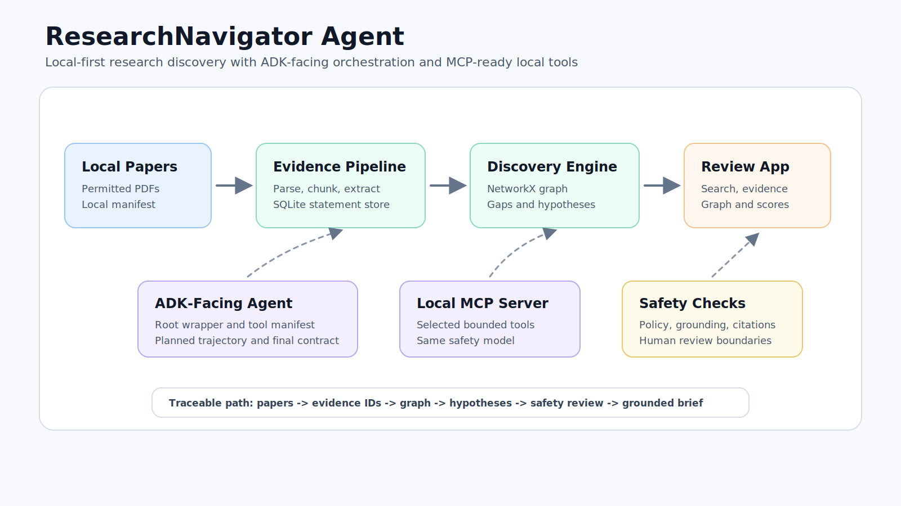

# ResearchNavigator Agent

Local research discovery agent for evidence-grounded scientific literature review.

ResearchNavigator Agent is a privacy-preserving, ADK-facing, MCP-ready research workflow that helps a user inspect a local set of scientific papers, extract structured evidence, build a knowledge graph, discover research gaps, generate speculative hypotheses, and evaluate whether outputs remain grounded in local evidence.

Core stack: `Google ADK-facing wrapper` `MCP local tool server` `Streamlit` `SQLite` `NetworkX` `pytest`

## Project Summary

ResearchNavigator helps researchers, students, and reviewers move from a set of papers to grounded research directions without sending documents to cloud services. It orchestrates deterministic tools for ingestion, statement extraction, retrieval, graph construction, gap discovery, hypothesis drafting, and safety evaluation, then surfaces the full path in a Streamlit review dashboard.

The workflow is organized as a local agentic loop:

1. Ingest permitted local PDFs.
2. Extract statements such as methods, datasets, results, limitations, and future work.
3. Store evidence in SQLite.
4. Build a NetworkX research graph.
5. Discover evidence-backed gaps.
6. Generate speculative, testable hypotheses and experiment plans.
7. Evaluate grounding, safety, testability, traceability, and caveats.
8. Present everything in a local Streamlit dashboard.

The main demo runs offline after dependencies are installed. It does not call external APIs, browse the web, deploy a server, train a model, or fine-tune a model.

## Why This Is An Agent

The project is intentionally built as a tool-orchestrating research agent rather than a single summarization script.

- It has a goal-directed loop: plan -> ingest -> extract -> retrieve evidence -> build graph -> discover gaps -> generate hypotheses -> evaluate -> produce a grounded brief.
- It exposes ADK-facing tools in [app/adk_tools.py](app/adk_tools.py) and an ADK root wrapper in [app/agent.py](app/agent.py).
- It includes an inspectable tool manifest, planned trajectory, safety gates, and final-answer contract.
- It treats papers as untrusted data and routes generated ideas through deterministic policy and evaluation checks.
- It exposes selected local tools through an MCP-compatible server in [app/mcp_server.py](app/mcp_server.py).
- It includes a deterministic agent trace artifact at [data/generated/agent_trace_demo.json](data/generated/agent_trace_demo.json), regenerated by [scripts/export_agent_trace.py](scripts/export_agent_trace.py).

The current implementation is a deterministic offline baseline with an ADK-facing wrapper already present. Future Gemini-assisted orchestration can be added behind the same policy, grounding, and human-review gates, but that is deliberately outside the current submission scope.

## Capstone Evaluation Coverage

| Course / rubric concept | Where it appears |
| --- | --- |
| ADK agent / tool orchestration | [app/agent.py](app/agent.py), [app/adk_tools.py](app/adk_tools.py), Streamlit `Pipeline Trace` tab |
| MCP server | [app/mcp_server.py](app/mcp_server.py), [scripts/run_mcp_server.py](scripts/run_mcp_server.py), `make mcp` |
| Antigravity/Codex usage | Use Kaggle media to show the AI-assisted development workflow |
| Security features | [tools/safety_tools.py](tools/safety_tools.py), [tools/policy_tools.py](tools/policy_tools.py), [scripts/check_no_secrets.py](scripts/check_no_secrets.py), [specs/safety_policy.md](specs/safety_policy.md) |
| Deployability / reproducibility | `make demo`, `make preflight`, `make validate`, `uv run pytest`, local artifact checks |
| Agent skills / Agents CLI | [SKILL.md](SKILL.md), `.agent/skills/research-navigator/SKILL.md`, ADK-facing tool design |
| Evaluation | [evals/golden_cases.json](evals/golden_cases.json), [scripts/run_golden_evals.py](scripts/run_golden_evals.py), [scripts/validate_submission.py](scripts/validate_submission.py) |
| Privacy-preserving workflow | Local PDFs, local SQLite, local graph, no required network calls after setup |

## Quickstart

From the project root:

```bash
uv run python -m scripts.run_demo --reset
uv run python -m scripts.export_agent_trace
uv run python -m scripts.preflight
uv run python -m scripts.validate_submission
uv run streamlit run ui/streamlit_app.py
```

Or use the Makefile:

```bash
make demo
make trace
make preflight
make validate
make ui
```

Useful validation commands:

```bash
uv run pytest
uv run python -m scripts.run_golden_evals
uv run python -m scripts.check_no_secrets
make validate
```

Open the dashboard and review these tabs:

- `Search`: search across local papers, evidence statements, gaps, hypotheses, and plans.
- `Evidence Inspector`: inspect statement IDs, compact snippets, paper IDs, quality signals, and linked discoveries.
- `Discoveries`: review ranked gaps, speculative hypotheses, and experiment plans.
- `Knowledge Graph`: inspect a local graph preview and node/edge tables.
- `Safety & Evaluation`: review grounding, safety, testability, traceability, and caveats.
- `Pipeline Trace`: inspect ADK-facing tools, planned trajectory, MCP wrapper, local commands, and generated artifacts.


## Architecture



Primary local artifacts:

- `data/processed/papers.sqlite`
- `data/processed/research_graph.graphml`
- `data/processed/gaps_and_hypotheses.json`
- `data/processed/evaluation_report.json`
- `data/processed/researchnavigator_brief.md`
- `data/generated/agent_trace_demo.json`

## Security And Privacy

Security is part of the workflow, not an afterthought.

- Paper text is treated as untrusted data, not instructions.
- Prompt-injection phrases in papers are flagged instead of followed.
- Generated gaps and hypotheses must reference local statement IDs.
- Hypotheses use the `speculative_research_hypothesis` safety label.
- Fake citations, unsupported claims, and overclaiming are evaluated.
- Policy rules keep external actions, model-changing workflows, and unsafe writes behind explicit review.
- [scripts/check_no_secrets.py](scripts/check_no_secrets.py) scans project text files for real-looking API keys, tokens, passwords, and private keys.

## Demo Workflow

1. Run `make demo` to rebuild local artifacts.
2. Run `make trace` to export the deterministic agent trajectory.
3. Launch `make ui`.
4. Search for `limitations evaluation dataset`.
5. Open a result and inspect linked evidence IDs.
6. Review ranked gaps and speculative hypotheses in `Discoveries`.
7. Inspect graph structure in `Knowledge Graph`.
8. Review scores and warnings in `Safety & Evaluation`.
9. Open `Pipeline Trace` to show the ADK-facing tool manifest, planned trajectory, MCP wrapper, and local reproducibility commands.

## Demo Screenshots

Search-first discovery:


Evidence inspector:


Ranked discoveries:


Knowledge graph preview:


Safety and evaluation:


## Repository Map

```text
app/                         ADK-facing agent wrapper, tool manifest, MCP server
configs/                     Local pipeline configuration
data/generated/              Deterministic generated demo artifacts
data/papers/                 Local permitted PDFs and manifest
data/processed/              Local pipeline outputs
docs/                        Public docs, screenshots, security review, reproducibility notes
evals/                       Golden evaluation cases
scripts/                     Python automation for local demo, eval, trace, validation, and security
specs/                       Project, safety, evaluation, behavior, and policy specs
tests/                       pytest suite for deterministic behavior
tools/                       PDF, storage, extraction, graph, gap, safety, policy, evaluation tools
ui/                          Streamlit dashboard
```

## Agent And MCP Commands

Run the local ADK-facing deterministic pipeline:

```bash
make demo
```

Export the deterministic agent trace:

```bash
make trace
```

Run the MCP-compatible local tool server:

```bash
make mcp
```

Run the Streamlit dashboard:

```bash
make ui
```
